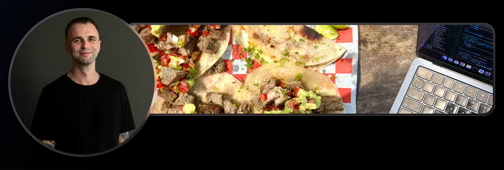

# 💻 Hello, I'm Lukas
A software engineer with a strong passion for design and web development. I started building my first websites at 13 and ever since, creating digital products has been a constant element in my day-to-day activities. Currently, the main focus is on JavaScript, TypeScript, React and Next.js, but I'm always looking for opportunities to evolve my skills and explore new advancements. Driven by a passion for learning and a growth-oriented mindset, software development has been the core part of my life. Beyond tech, writing is a long-standing passion of mine, with several published articles and, most recently, my first book. As a big fan of tacos and music, I love blending creativity, spices, and technology in everything I do.

Also, don't forget to check out my portfolio: [lukaskouril.vercel.app](https://lukaskouril.vercel.app/) 👨🏻‍💻

## Tech Stack 🛠️ 
- **Languages:** JavaScript, TypeScript, HTML5, CSS3  
- **Frontend:** React, Next.js, Vue, TailwindCSS, Bootstrap  
- **Backend & DB:** Node.js, Express, Prisma, PostgreSQL  
- **Tools & DevOps:** Git, GitHub, Docker, Vercel, Yarn, NPM  
- **Extras:** ShadCN, MaterialUI, i18n, REST APIs, Figma, Photoshop

## Beyond Code
- ✈️ Traveled, lived, and worked in Bangkok, Barcelona, Reykjavik, Gibraltar, Mexico, Japan and beyond  
- 🎤 Organizer of hip hop events, radio shows, and community projects  
- 📚 Author with OKRAJ Media (*Rapovej denik Lukase Kourila*, ... ) 

